# BOBC - Tokenized Boliviano with On-Chain Regulatory Compliance

> **Convergence: A Chainlink Hackathon | February - March 2026**
>
> Tracks: **DeFi & Tokenization** | **CRE & AI** | **Risk & Compliance**
>
> **Live Demo:** [app.condordev.xyz](https://app.condordev.xyz/)

BOBC is a **production-ready stablecoin** pegged 1:1 to the Bolivian Peso (BOB) with full regulatory compliance enforced on-chain. It combines **Chainlink CRE** for fiat-blockchain bridging, **Chainlink ACE-compatible** smart contracts for compliance enforcement, and an **AI Agent (Claude MCP)** that operates bank-side processes autonomously.

Bolivia has been on the **FATF grey list since 2020** — Bolivians cannot access DeFi, banks spend millions on manual KYC/AML, and no stablecoin satisfies local regulation. BOBC solves this by embedding every Bolivian compliance rule directly into smart contracts, making regulatory enforcement automatic, transparent, and auditable.

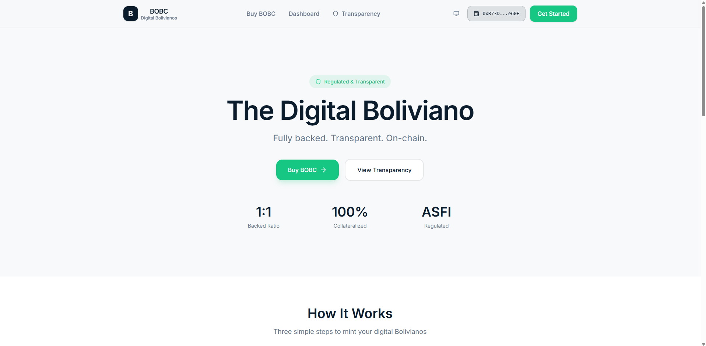

### Business Model

BOBC is free to mint and redeem at a 1:1 rate. Revenue comes from deploying idle reserves into low-risk, regulated yield instruments (government bonds, overnight repos) — the same model used by major stablecoins. As adoption grows, the spread between reserve yield and zero-cost minting sustains operations, compliance infrastructure, and further development — all while maintaining full 1:1 collateralization at all times.

---

## Table of Contents

- [System Architecture](#system-architecture)
- [Hackathon Track Mapping](#hackathon-track-mapping)
- [CRE Workflow](#cre-workflow)
- [Smart Contracts (ACE)](#smart-contracts-ace)
- [AI Agent (MCP)](#ai-agent-mcp)
- [Frontend](#frontend)
- [Deployed Contracts](#deployed-contracts)
- [Lines of Code](#lines-of-code)
- [Getting Started](#getting-started)
- [Tests](#tests)
- [Documentation](#documentation)
- [Repository Structure](#repository-structure)

---

## System Architecture

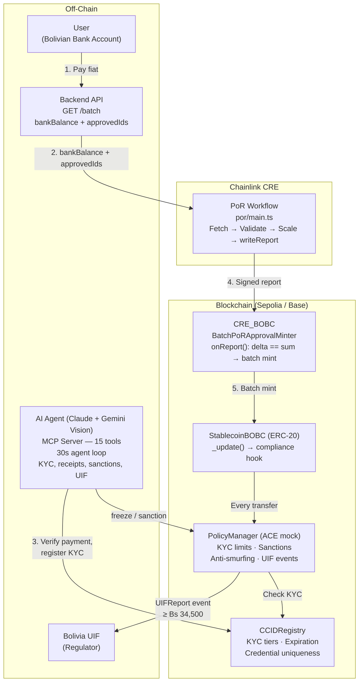

---

## Hackathon Track Mapping

### Track 1: DeFi & Tokenization

BOBC is a **stablecoin issuance mechanism** with **Proof of Reserve data feeds** and **tokenized asset lifecycle management** (mint, transfer, redeem).

- **CRE `writeReport`** — signs PoR payload and delivers on-chain via `EVMClient.writeReport()` — [`por/main.ts` L65-L110][t1-write]
- **CRE `onReport` receiver** — enforces `delta == sum` before batch minting — [`CRE_BOBC.sol` L138-L166][t1-onreport]
- **ERC-20 with compliance hook** — `_update()` calls PolicyManager on every transfer — [`StablecoinBOB.sol` L103-L128][t1-token]
- **Mint + Redeem contracts** — [`MinterContract.sol`][t1-mint] | [`RedeemContract.sol`][t1-redeem]

[t1-write]: https://github.com/fabriciojallaza/bobc/blob/f9cf55cb/CRE_Chainlink/por/main.ts#L65-L110
[t1-onreport]: https://github.com/fabriciojallaza/bobc/blob/f9cf55cb/ACE_Chainlink/src/CRE_BOBC.sol#L138-L166
[t1-token]: https://github.com/fabriciojallaza/bobc/blob/f9cf55cb/ACE_Chainlink/src/StablecoinBOB.sol#L103-L128
[t1-mint]: https://github.com/fabriciojallaza/bobc/blob/f9cf55cb/ACE_Chainlink/src/MinterContract.sol
[t1-redeem]: https://github.com/fabriciojallaza/bobc/blob/f9cf55cb/ACE_Chainlink/src/RedeemContract.sol

### Track 2: CRE & AI

A production CRE workflow + an AI agent operating bank processes autonomously.

- **CRE PoR Workflow** — `CronCapability` → `HTTPClient.sendRequest` → `runtime.report()` → `EVMClient.writeReport` — [`por/main.ts` L38-L140][t2-por]
- **AI Agent + CRE bridge** — Gemini Vision validates receipts, then calls `cre_create_order` to create on-chain orders for CRE — [`AGENT/index.js` L109-L193][t2-agent]
- **On-chain order creation** — `CRE_BOBC.createOrder()` via viem — [`chain.js` L399-L460][t2-chain] | Solidity: [`CRE_BOBC.sol` L110-L129][t2-create]
- **BatchMinted event watcher** — listens to CRE_BOBC events after oracle mints tokens — [`watcher/index.js` L30-L54][t2-watcher] | Solidity (oracle mint): [`CRE_BOBC.sol` L138-L166][t2-onreport]

[t2-por]: https://github.com/fabriciojallaza/bobc/blob/f9cf55cb/CRE_Chainlink/por/main.ts#L38-L140
[t2-agent]: https://github.com/fabriciojallaza/bobc/blob/f9cf55cb/AGENT/index.js#L109-L193
[t2-chain]: https://github.com/fabriciojallaza/bobc/blob/f9cf55cb/ACE_Chainlink/backend/chain.js#L399-L460
[t2-create]: https://github.com/fabriciojallaza/bobc/blob/f9cf55cb/ACE_Chainlink/src/CRE_BOBC.sol#L110-L129
[t2-watcher]: https://github.com/fabriciojallaza/bobc/blob/f9cf55cb/AGENT/watcher/index.js#L30-L54
[t2-onreport]: https://github.com/fabriciojallaza/bobc/blob/f9cf55cb/ACE_Chainlink/src/CRE_BOBC.sol#L138-L166

### Track 3: Risk & Compliance

Full Bolivian regulatory compliance enforced on-chain — CRE delivers PoR data, contracts enforce invariants.

- **CRE `onReport` PoR invariant** — `delta != sum` reverts, preventing issuance without reserves — [`CRE_BOBC.sol` L138-L166][t3-onreport]
- **PolicyManager (ACE mock)** — KYC-tiered limits, sanctions, anti-smurfing (5tx/hr), auto UIF reports — [`PolicyManager.sol` L57-L96][t3-policy]
- **CCIDRegistry (ACE mock)** — on-chain identity with tiers, expiration, credential uniqueness — [`CCIDRegistry.sol`][t3-ccid]
- **48-hour timelock** for compliance engine migration to real ACE — [`StablecoinBOB.sol` L82-L100][t3-timelock]
- **55 contract tests** covering all compliance rules — [`ACE_Chainlink/test/`][t3-tests]

#### On-Chain Compliance Enforcement Flow

Every single ERC-20 operation (mint · transfer · burn) passes through this enforcement pipeline before execution:

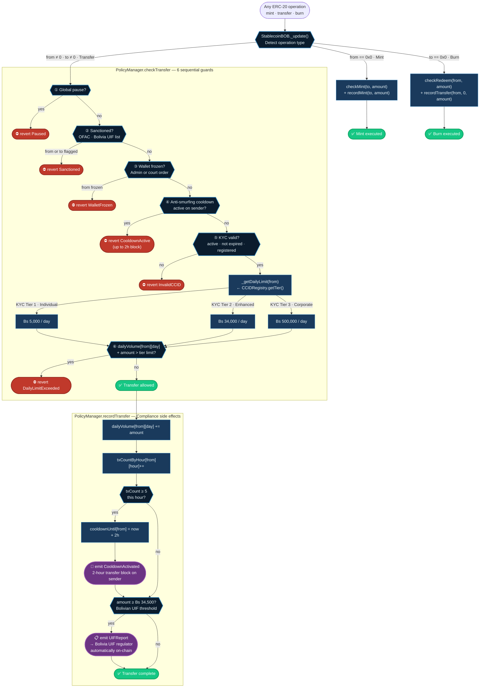

[t3-onreport]: https://github.com/fabriciojallaza/bobc/blob/f9cf55cb/ACE_Chainlink/src/CRE_BOBC.sol#L138-L166
[t3-policy]: https://github.com/fabriciojallaza/bobc/blob/f9cf55cb/ACE_Chainlink/src/PolicyManager.sol#L57-L96
[t3-ccid]: https://github.com/fabriciojallaza/bobc/blob/f9cf55cb/ACE_Chainlink/src/CCIDRegistry.sol
[t3-timelock]: https://github.com/fabriciojallaza/bobc/blob/f9cf55cb/ACE_Chainlink/src/StablecoinBOB.sol#L82-L100
[t3-tests]: https://github.com/fabriciojallaza/bobc/blob/f9cf55cb/ACE_Chainlink/test/

---

## CRE Workflow

CRE serves as BOBC' **oracle execution and automation layer** — it reliably fetches off-chain reserve and approval state, packages it as an authenticated report, and delivers it on-chain. CRE does **not** decide who gets minted or how much; the on-chain receiver contract performs all enforcement deterministically. This separation is intentional: **CRE provides trustworthy delivery; the contract provides deterministic enforcement.**

### PoR Workflow (Batch Minting with Dual Controls)

The core CRE integration: fetches approved orders + bank balance from the backend API, writes a signed report to the [`CRE_BOBC`](CRE_Chainlink/contracts/abi/CRE_Oracle_minter.sol) receiver contract on Sepolia (`0x87ba13aF77c9c37aBa42232B4C625C066a433eeE`). The contract enforces `delta == sum` before batch minting.

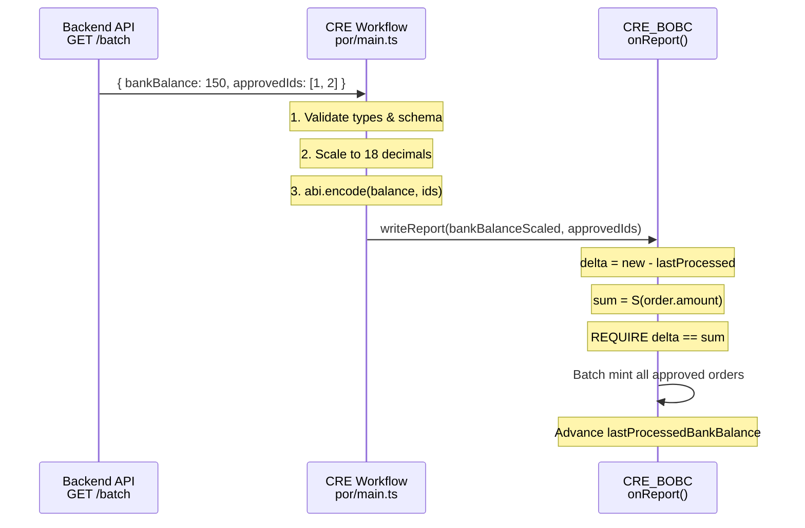

**Key files:** [`CRE_Chainlink/por/main.ts`](CRE_Chainlink/por/main.ts) | [`CRE_Chainlink/contracts/abi/CRE_Oracle_minter.sol`](CRE_Chainlink/contracts/abi/CRE_Oracle_minter.sol) | [`CRE_Chainlink/por/config.json`](CRE_Chainlink/por/config.json)

> Full CRE documentation: [`CRE_Chainlink/README.md`](CRE_Chainlink/README.md) — What CRE does, what it reads, what it writes, and how the on-chain contract enforces correctness

---

## Smart Contracts (ACE)

Six Solidity contracts implementing the BOBC stablecoin with full compliance lifecycle. Built with Foundry, deployed on Ethereum Sepolia and Base Sepolia.

| Contract             | File                                    | Role                                              |
|----------------------|-----------------------------------------|---------------------------------------------------|
| **StablecoinBOB**    | [`StablecoinBOB.sol`][sol-token]        | ERC-20 with `_update()` compliance hook           |
| **PolicyManager**    | [`PolicyManager.sol`][sol-policy]       | ACE mock: KYC limits, sanctions, anti-smurfing    |
| **CCIDRegistry**     | [`CCIDRegistry.sol`][sol-ccid]          | Cross-chain identity with tiers + expiration      |
| **MinterContract**   | [`MinterContract.sol`][sol-minter]      | Mints BOBC after fiat deposit confirmed by oracle |
| **RedeemContract**   | [`RedeemContract.sol`][sol-redeem]      | Burns BOBC + requests bank transfer               |
| **FiatDepositOracle**| [`FiatDepositOracle.sol`][sol-oracle]   | CRE oracle: confirms deposits, tracks reserves    |
| **CRE_BOBC**        | [`CRE_Oracle_minter.sol`][sol-cre]      | CRE receiver: batch PoR + approval minting        |
| **MintableToken**    | [`token.sol`][sol-mintable]             | Minimal ERC-20 for CRE workflow                   |

[sol-token]: ACE_Chainlink/src/StablecoinBOB.sol
[sol-policy]: ACE_Chainlink/src/PolicyManager.sol
[sol-ccid]: ACE_Chainlink/src/CCIDRegistry.sol
[sol-minter]: ACE_Chainlink/src/MinterContract.sol
[sol-redeem]: ACE_Chainlink/src/RedeemContract.sol
[sol-oracle]: ACE_Chainlink/src/FiatDepositOracle.sol
[sol-cre]: CRE_Chainlink/contracts/abi/CRE_Oracle_minter.sol
[sol-mintable]: CRE_Chainlink/contracts/abi/token.sol

### Compliance Rules (Bolivian Regulation)

| Rule                    | Parameter      | Enforcement                                   |
|-------------------------|----------------|-----------------------------------------------|
| KYC Tier 1 (Individual) | Bs 5,000/day   | `PolicyManager._getDailyLimit()`              |
| KYC Tier 2 (Enhanced)   | Bs 34,000/day  | `PolicyManager._getDailyLimit()`              |
| KYC Tier 3 (Corporate)  | Bs 500,000/day | `PolicyManager._getDailyLimit()`              |
| UIF Threshold           | >= Bs 34,500   | Auto `UIFReport` event in `recordTransfer()`  |
| Anti-Smurfing           | 5 tx/hour      | 2-hour cooldown via `txCountByHour`           |
| Sanctions               | OFAC + UIF     | Block all operations for sanctioned wallets   |
| Identity Expiration     | 365 days       | Annual renewal required in `CCIDRegistry`     |
| Timelock                | 48 hours       | All critical contract upgrades                |

> Full ACE documentation: [`ACE_Chainlink/README.md`](ACE_Chainlink/README.md)

---

## AI Agent (MCP)

An AI agent (Claude) operates as the day-to-day bank administrator via **Model Context Protocol (MCP)**. The agent loop polls every 30 seconds, processing pending KYC requests and orders autonomously. Receipt validation uses **Gemini Vision** for image analysis. The MCP server exposes 15 tools — 8 for off-chain bank operations and 7 for on-chain contract administration.

### Bank Operations (off-chain)

| Tool                         | Purpose                                    |
|------------------------------|--------------------------------------------|
| `confirm_deposit`            | Confirm fiat deposits, trigger mint flow   |
| `get_reserves_balance`       | Query custodial bank balance for PoR       |
| `execute_bank_transfer`      | Execute outgoing transfers for redemptions |
| `get_transaction_status`     | Query deposit/transfer status              |
| `verify_account_ownership`   | Verify bank account belongs to user        |
| `link_wallet_to_account`     | Link wallet to bank account                |
| `generate_uif_report`        | File SAR with Bolivia's UIF                |
| `get_account_history`        | Audit transaction history                  |

### Contract Admin (on-chain)

| Tool                                   | Purpose                                       |
|----------------------------------------|-----------------------------------------------|
| `register_identity`                    | Register KYC identity on CCIDRegistry         |
| `revoke_identity`                      | Revoke identity (fraud, expiry, court order)  |
| `freeze_wallet` / `unfreeze_wallet`    | Freeze/unfreeze wallets on PolicyManager      |
| `add_to_sanctions`                     | Add to sanctions list (irreversible by agent) |
| `cre_create_order`                     | Create on-chain order on CRE_BOBC for minting |
| `link_bank_account`                    | Link wallet to bank account on RedeemContract |
| `emergency_mint`                       | Fallback mint when CRE is unavailable         |

**Key files:** [`ACE_Chainlink/backend/mcp-server.js`](ACE_Chainlink/backend/mcp-server.js) | [`ACE_Chainlink/backend/chain.js`](ACE_Chainlink/backend/chain.js) | [`ACE_Chainlink/backend/db.js`](ACE_Chainlink/backend/db.js)

> Full MCP specification: [`ACE_Chainlink/docs/BANK_MCP_SPEC.md`](ACE_Chainlink/docs/BANK_MCP_SPEC.md)

---

## Frontend

React SPA for user-facing operations: KYC submission, token purchase, dashboard, and transparency page.

- **Stack**: React 18 + Vite + Tailwind CSS v4 + Wagmi v3 + Shadcn/Radix UI
- **Web3**: Wallet connection via MetaMask (injected connector)
- **API**: All backend calls via [`frontend/src/app/config/api.ts`](frontend/src/app/config/api.ts)
- **Pages**: Landing, Buy (KYC + order flow), Dashboard (balances + history), Transparency (reserves + agent activity)

### KYC Flow (AI Agent verifies identity on-chain)

| Submit KYC | Agent Verifying | KYC Approved |
|:---:|:---:|:---:|
| 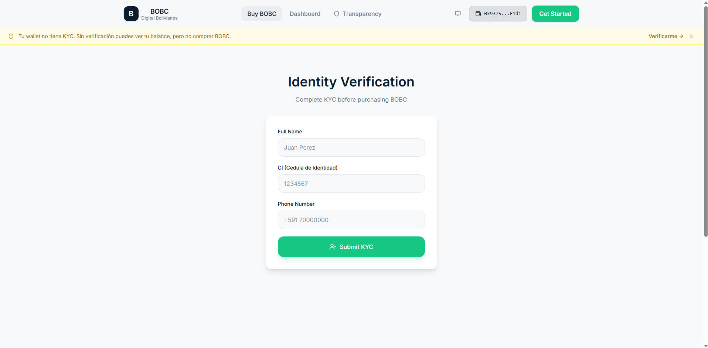 | 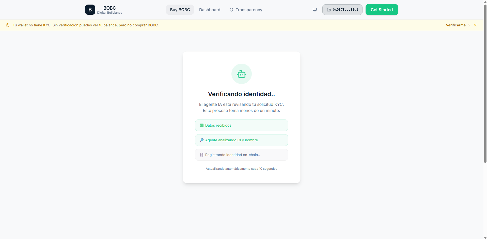 | 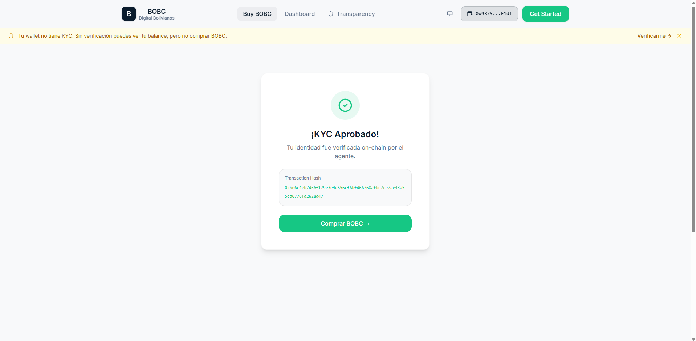 |

### Buy Flow (Bank transfer → Agent validates receipt → CRE batch mints)

| Place Order | Bank Transfer + Receipt | Agent Processing | BOBC Minted |
|:---:|:---:|:---:|:---:|
| 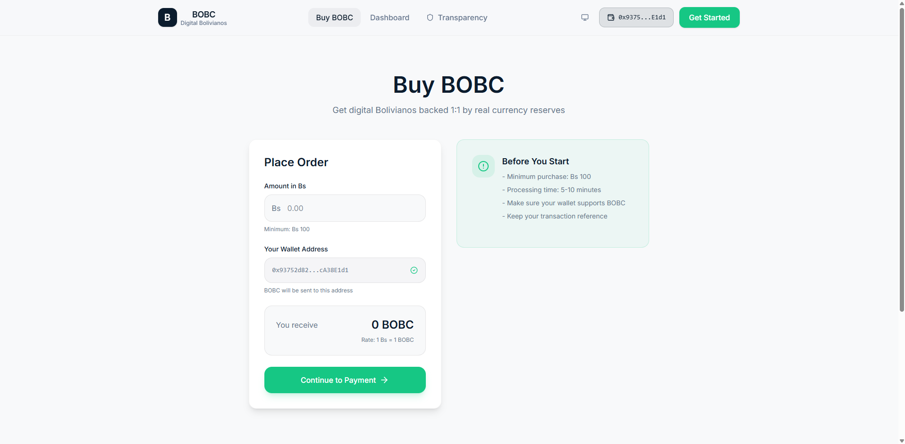 | 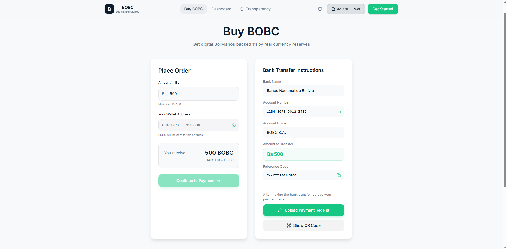 | 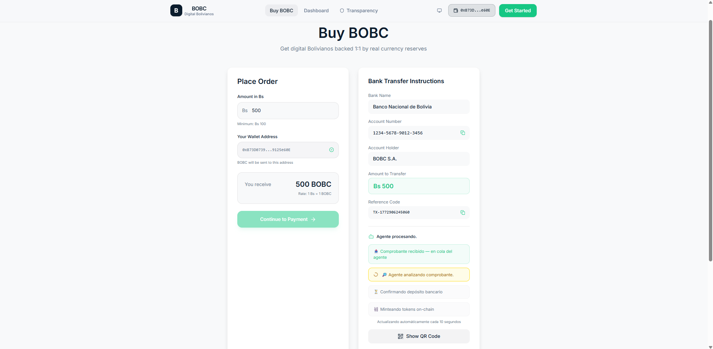 | 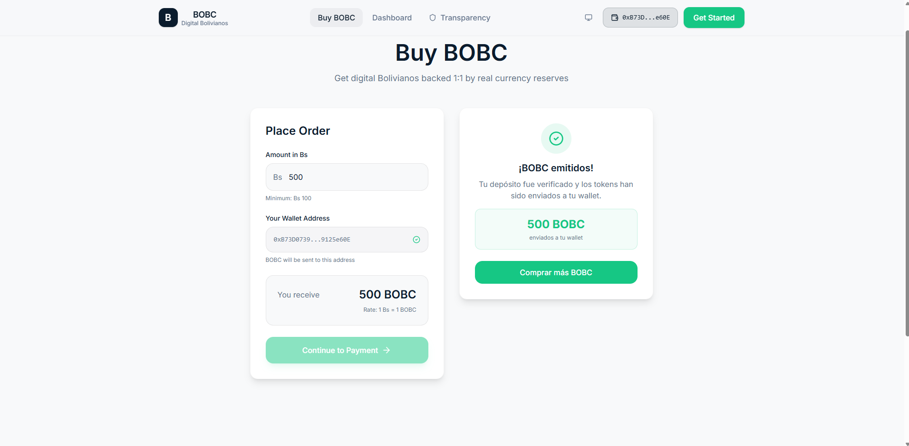 |

### Dashboard & Transparency

| Dashboard | Proof of Reserves | Minting Rule |
|:---:|:---:|:---:|
| 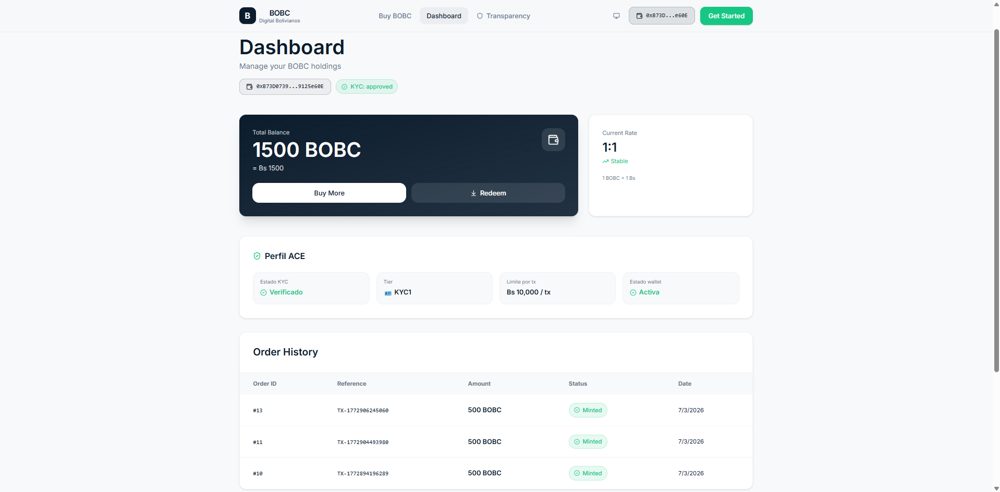 | 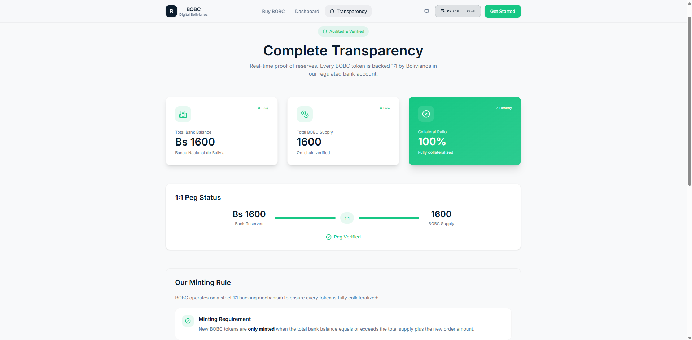 | 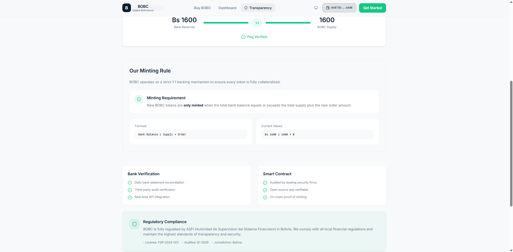 |

---

## Deployed Contracts

### Ethereum Sepolia (Chain ID: 11155111)

| Contract                            | Address                                      | Verified |
|-------------------------------------|----------------------------------------------|----------|
| CCIDRegistry                        | `0x9968c2c127d3d88de61c87050ae3ef398eaf9719` | Yes      |
| PolicyManager                       | `0x1c57a01b0e1f95848b22f31e8f90e9b07728dfe9` | Yes      |
| CRE_BOBC (BatchPoRApprovalMinter)   | `0x87ba13aF77c9c37aBa42232B4C625C066a433eeE` | —        |
| StablecoinBOBC                      | `0xf132Ba93754206DF89E61B43A9800498B7062C13` | Yes      |

### Base Sepolia (Chain ID: 84532)

| Contract      | Address                                      |
|---------------|----------------------------------------------|
| CCIDRegistry  | `0x9968c2c127d3d88de61c87050ae3ef398eaf9719` |
| PolicyManager | `0x1c57a01b0e1f95848b22f31e8f90e9b07728dfe9` |

---

## Lines of Code

| Module                         | Language       | Files  | Lines      |
|--------------------------------|----------------|--------|------------|
| Smart Contracts (source)       | Solidity       | 9      | 1,117      |
| Smart Contract Tests           | Solidity       | 7      | 765        |
| CRE Workflow                   | TypeScript     | 1      | 147        |
| Backend (MCP + HTTP + Chain)   | JavaScript     | 5      | 2,565      |
| Frontend                       | TypeScript/TSX | 62     | 7,013      |
| **Total**                      |                | **84** | **11,607** |

---

## Getting Started

### Prerequisites

- [Foundry](https://book.getfoundry.sh/getting-started/installation) for smart contracts
- [CRE CLI](https://docs.chain.link/cre) for CRE workflows
- [Node.js](https://nodejs.org/) 18+ for backend
- [pnpm](https://pnpm.io/) for frontend

### Smart Contracts

```bash
cd ACE
forge install
forge build
forge test -vvv          # 55 tests, 0 failures
```

### CRE Workflow

```bash
cd CRE_Chainlink/por
cre workflow simulate --target staging-settings

# Broadcast to testnet
cre workflow simulate --target staging-settings --broadcast
```

### Backend

```bash
cd ACE_Chainlink/backend
npm install
npm run dev              # starts MCP + HTTP servers
```

### Frontend

```bash
cd frontend
pnpm install
pnpm run dev             # starts Vite dev server
```

---

## Tests

```
55 tests, 0 failures
```

| Suite                  | Coverage                                                           |
|------------------------|--------------------------------------------------------------------|
| `CCIDRegistry.t.sol`   | Registration, revocation, expiration, credential uniqueness, tiers |
| `PolicyManager.t.sol`  | KYC1/2/3 limits, sanctions, freeze, cooldown, anti-smurfing, UIF  |
| `StablecoinBOB.t.sol`  | Mint, burn, transfer with compliance hooks, timelock, pause        |
| `MinterContract.t.sol` | Valid mint, double-mint, expired deposit, insufficient reserves    |
| `RedeemContract.t.sol` | Valid redeem, minimum, no bank account, UIF report, force redeem   |
| `Integration.t.sol`    | Full mint-transfer-redeem flow, multi-tier, edge cases             |

---

## Documentation

| Document                                 | Description                                                                      |
|------------------------------------------|----------------------------------------------------------------------------------|
| [`ACE_Chainlink/README.md`][doc-ace]               | Smart contracts architecture and compliance rules                                |
| [`CRE_Chainlink/README.md`][doc-cre]     | Chainlink CRE in BOBC: what it reads, writes, and how on-chain enforcement works |
| [`CRE_SPEC.md`][doc-cre-spec]           | CRE Oracle specification (3 jobs)                                                |
| [`BANK_MCP_SPEC.md`][doc-mcp]           | AI Agent MCP specification (15 tools)                                            |
| [`ACE_INTEGRATION.md`][doc-ace-int]      | Chainlink ACE integration and migration guide                                    |
| [`CRE_INTEGRATION.md`][doc-cre-int]     | CRE PoR deployment and integration guide                                         |
| [`VALIDATION_REPORT.md`][doc-val]        | Validation report: 26 PASS, 4 PARTIAL, 1 FAIL                                   |

[doc-ace]: ACE_Chainlink/README.md
[doc-cre]: CRE_Chainlink/README.md
[doc-cre-spec]: ACE_Chainlink/docs/CRE_SPEC.md
[doc-mcp]: ACE_Chainlink/docs/BANK_MCP_SPEC.md
[doc-ace-int]: ACE_Chainlink/docs/ACE_INTEGRATION_GUIDE.md
[doc-cre-int]: ACE_Chainlink/docs/CRE_INTEGRATION.md
[doc-val]: ACE_Chainlink/docs/VALIDATION_REPORT.md

---

## Repository Structure

```
bobc/
+-- ACE_Chainlink/                    # Smart contracts + backend
|   +-- src/                          #   Solidity contracts
|   |   +-- StablecoinBOB.sol         #     ERC-20 with compliance hooks
|   |   +-- PolicyManager.sol         #     ACE mock: limits, sanctions, anti-smurfing
|   |   +-- CCIDRegistry.sol          #     Cross-chain identity registry
|   |   +-- CRE_BOBC.sol             #     CRE receiver: batch PoR + approval minting
|   |   +-- MinterContract.sol        #     Fiat-to-token minting
|   |   +-- RedeemContract.sol        #     Token-to-fiat redemption
|   |   +-- FiatDepositOracle.sol     #     CRE oracle for deposit confirmation
|   |   +-- interfaces/               #     ACE-compatible interfaces
|   +-- test/                         #   7 test files, 55 tests
|   +-- script/                       #   Foundry deployment scripts
|   +-- backend/                      #   Node.js backend
|   |   +-- mcp-server.js            #     MCP server with 15 tools
|   |   +-- http-server.js           #     REST API (KYC, orders, batch)
|   |   +-- chain.js                 #     On-chain interaction (viem)
|   |   +-- db.js                    #     SQLite database layer
|   +-- docs/                         #   Specifications and guides
+-- CRE_Chainlink/                    # Chainlink CRE workflow
|   +-- por/                          #   PoR batch minting workflow
|   |   +-- main.ts                  #     Fetch, validate, writeReport
|   |   +-- config.json              #     Schedule, URL, receiver
|   +-- contracts/abi/                #   On-chain receiver + token ABIs
+-- AGENT/                            # AI Agent (autonomous loop)
|   +-- index.js                      #   Agent loop (30s polling)
|   +-- llm.js                        #   Claude + Gemini Vision integration
|   +-- tools.js                      #   Agent tool definitions
|   +-- watcher/                      #   On-chain event watcher
+-- frontend/                         # React SPA
|   +-- src/app/components/           #   Page components + UI library
|   +-- src/app/config/               #   Wagmi + API client
+-- CLAUDE.md                         # Development instructions
```

---

**Built for Convergence: A Chainlink Hackathon 2026** — *Bringing Bolivia on-chain, compliantly.*
